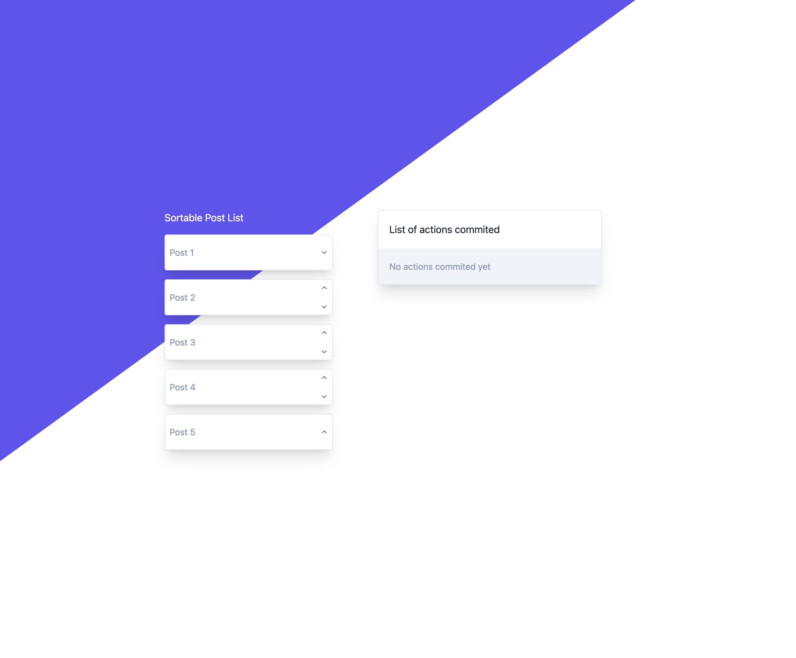

# Sortable post list

> Node.js v18 or higher needed



## How to
1. Install dependencies
```bash
pnpm i
```

2. Run dev server
```bash
pnpm run dev
```
This command will run a server in port `3000`: http://localhost:3000

## Tests
In order to run the unit tests
```bash
pnpm test
```